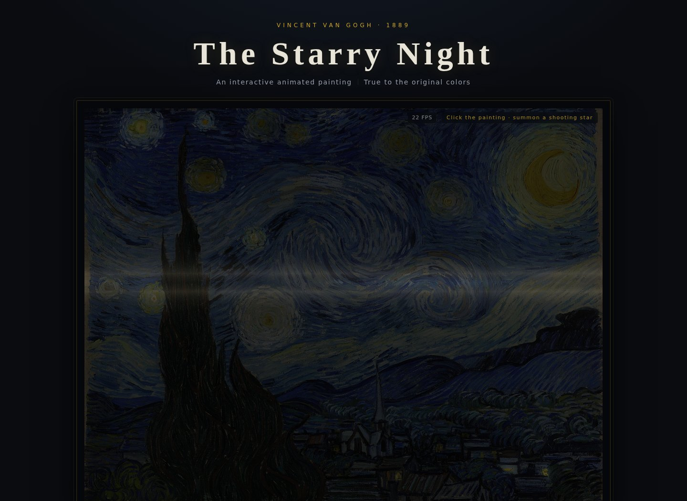

# The Starry Night — Animated

An interactive, real-time WebGL tribute to Vincent van Gogh's *The Starry Night* (1889).
The painting comes alive in your browser, in the gentle way a beloved anime scene
comes alive: the great sky whirlpools slowly **rotate** like drifting pinwheels,
star halos **spin** with tiny orbiting sparkles, the moon's radiant halo turns as it
breathes, the cypress sways in the wind and the village window lights flicker like
candlelight — all wrapped in a soft, **generative soundtrack** composed live by your
browser. **Every color is sampled from the painting itself, so Van Gogh's palette is
never altered**, and the canvas always keeps the artwork's true proportions.

Rebuilt and upgraded from
[CathyKernel/Animated-version-of-Van-Gogh-Starry-Night](https://github.com/CathyKernel/Animated-version-of-Van-Gogh-Starry-Night)
(original: a Python/OpenCV script that rendered an 8-second MP4). This version adds a
zero-dependency WebGL web app plus a much-improved Python video generator.



The page is intentionally minimal: nothing but the framed painting, a small sound
toggle in the corner and a one-time hint. No control bars, no panels — just the
artwork, alive.

## What moves

| Element | Animation |
|---|---|
| **The twin whirlpools** | Van Gogh's two big sky swirls genuinely **rotate** — a slow pinwheel motion (one revolution per ~40–56 s, opposite directions) with a soft luminous ripple locked to the turn |
| **Eleven stars + Venus** | Each halo **spins** around its real painted position (alternating directions, 14–24 s per turn) while twinkling with its own phase; two tiny four-point anime sparkles orbit every star |
| **The moon** | The radiant halo slowly rotates (~68 s per turn) while the crescent breathes on a ~14 s cycle |
| **The cypress** | The dark flame sways in the wind: wide slow sweeps at the crown, quick tremors among the leaves, steady roots (amplitude driven by a generated mask) |
| **The village** | Thirteen window lights flicker in a two-frequency candlelight rhythm over a slow warm swell |
| **The sky** | Curl-noise advection streams the brushwork like a night current |
| **Shooting stars** | A meteor crosses the sky once in a while — or click the sky to summon one |
| **The soundtrack** | A dreamy 8-bar loop (64 BPM) generated with the Web Audio API: felt-piano arpeggios, warm pads, soft bass, glassy chimes and a long reverb. No audio files, nothing copyrighted |

> All colors are extracted from the original painting's pixels at load time
> (glow colors included), so the animation only changes brightness and position —
> never the hues.

## True to the original proportions

The original canvas is 73.7 × 92.1 cm; the scan used here is 1280 × 1014 px
(ratio **1.2623 : 1**). The page locks the painting to exactly that aspect ratio at
every window size — desktop, tablet, phone, fullscreen — so the artwork is never
stretched or distorted.

## Project structure

```
animated-starry-night/
├── index.html               # entry point — works offline via file:// too
├── netlify.toml             # Netlify deploy config (static site, no build step)
├── css/
│   └── style.css            # gallery theme: framed painting at true aspect ratio
├── js/
│   ├── scene-data.js        # element data + painting/mask embedded as base64 (generated)
│   ├── starry-engine.js     # WebGL engine: shaders + render loop
│   ├── music.js             # generative Web Audio soundtrack
│   └── main.js              # page wiring (music wake-up, click-to-meteor, keys)
├── assets/
│   ├── starry-night.jpg     # the painting (Wikimedia Commons, 1280px)
│   ├── masks.png            # cypress sway-amplitude mask (generated)
│   ├── elements.json        # detected element coordinates (generated)
│   └── screenshot.jpg       # preview image for this README
└── python/
    ├── starry_night_enhanced.py   # upgraded video generator (MP4)
    └── analyze_elements.py        # element detection (generates masks + data)
```

## Run locally

No build step, no dependencies. Either:

- **Double-click `index.html`** — the painting and masks are embedded as base64,
  so it works fully offline, or
- serve it (recommended, closest to production):

```bash
cd animated-starry-night
python3 -m http.server 8000
# open http://localhost:8000
```

### Controls

The page keeps itself deliberately quiet, but a few gentle interactions remain:

| Action | How |
|---|---|
| Start the music | Click / tap anywhere once (browsers require one interaction before audio), or press `M` |
| Play / pause the music | The round button in the corner, or `M` |
| Summon a shooting star | Click anywhere on the sky |
| Pause / resume the painting | `Space` |
| Fullscreen | `F` |

The opening reveal (~2.8 s) is a nod to the original project's
`smooth_unfold_effect`.

## Deploy to Netlify

The site is 100% static — deployment takes under a minute.

### Option A — drag & drop (fastest)

1. Download / unzip this folder.
2. Go to <https://app.netlify.com/drop>.
3. Drag the whole `animated-starry-night` folder onto the page.
4. Netlify publishes it immediately at a random `*.netlify.app` URL
   (you can rename it under *Site settings → Change site name*).

### Option B — GitHub + Netlify auto-deploy (recommended)

1. **Push this folder to GitHub** (see the next section).
2. In Netlify: **Add new site → Import an existing project → GitHub**,
   then pick your repository.
3. Build settings (Netlify usually fills these in automatically from
   `netlify.toml`; if not, set them manually):
   - **Branch to deploy:** `main`
   - **Build command:** *(leave empty)*
   - **Publish directory:** `.`
4. Click **Deploy**. Every future `git push` now redeploys the site automatically.

## Push to GitHub

```bash
cd animated-starry-night
git init
git add .
git commit -m "The Starry Night — animated WebGL tribute"
git branch -M main
git remote add origin https://github.com/<your-username>/<your-repo>.git
git push -u origin main
```

(Or upload the folder via GitHub's web UI: *New repository → uploading an
existing file* — make sure `index.html` sits at the repository root.)

## Python video generator (optional)

The `python/` folder contains the upgraded offline renderer, for when you want
an MP4 instead of the live web app:

```bash
cd python
pip install opencv-python numpy requests pillow

python3 starry_night_enhanced.py                      # 12 s / 30 fps / 1024px
python3 starry_night_enhanced.py --duration 20 --fps 30 --size 1280 --output my.mp4
python3 starry_night_enhanced.py --no-oil --no-vignette   # cleaner look
python3 starry_night_enhanced.py --image ../assets/starry-night.jpg
```

What changed vs. the original script:

| Original function | This version |
|---|---|
| `enhance_colors_dynamically` | **Removed** — LAB saturation/contrast oscillation drifted the colors away from the painting |
| `create_starry_particles` | **Rewritten** — particles emit from the real star positions instead of random spots all over the frame |
| `create_dynamic_swirl_flow_field` | **Improved** — vortices centered on the painting's twin swirls, sky-only influence, gentler strength |
| `advanced_oil_painting` | **Vectorized** — from minutes per frame (pure Python loops) to tens of milliseconds |
| `add_glow_effect` | **Improved** — bloom-style glow sampled from the painting's own bright areas |
| `smooth_unfold_effect` | **Kept** as the intro reveal |
| — | **New** `detect_elements` + `animate_stars` / `animate_moon` / `sway_cypress` / `flicker_windows` |

## How element detection works

`python/analyze_elements.py` (the web build uses the same pipeline):

1. **Cypress** — the darkest tall olive-green blob in the left region; a
   sway-amplitude map (`masks.png`) is generated from treetop (1) to roots (0).
2. **Moon** — the largest bright blob in the upper right; the centroid of its
   V > 238 pixels marks the crescent core.
3. **Stars** — bright warm blobs in the sky (cypress excluded), with
   morphological merging so halos (Venus splits into fragments) join up.
4. **Window lights** — small warm blobs in the village band.

The result is then curated by hand/vision-model review and stored in
`assets/elements.json`.

## Technical notes

- The web animation is a single **WebGL1 fragment shader**: a displacement
  field warps the painting's texture coordinates first (twin *rotating*
  vortices, spinning star & moon halos, curl-noise advection, cypress sway),
  then brightness pulsing is applied on top. Rotation angles are computed in
  JavaScript and wrapped to 0–2π, so the spinning loops forever without
  precision drift or a visible seam.
- All radial glows are aspect-corrected, so halos and sparkles stay perfectly
  round at any window size.
- **Smooth by design:** one render pass, no per-frame allocations, a capped
  backing-store resolution and an adaptive quality scaler that quietly nudges
  render resolution down (and back up) to hold a fluid frame rate on any GPU.
- **The soundtrack** is synthesized live with the Web Audio API (oscillators,
  filters, a generated convolution reverb and a look-ahead scheduler), so it
  loops seamlessly forever with zero downloads and zero licensing worries.
- Glow colors are extracted at runtime from the painting's own pixels
  (mean of the brightest 30% per element), so halos always match the artwork.
- Compatibility: Chrome / Edge / Firefox / Safari; graceful fallback to the
  static painting when WebGL is unavailable. `prefers-reduced-motion` visitors
  get a slower, calmer animation.

## Credits

- Original painting: Vincent van Gogh, *The Starry Night*, 1889 — MoMA, New York (public domain)
- Image: Wikimedia Commons (Google Art Project digitization)
- Base project: [CathyKernel/Animated-version-of-Van-Gogh-Starry-Night](https://github.com/CathyKernel/Animated-version-of-Van-Gogh-Starry-Night)
- Code in this repository: MIT License (see `LICENSE`)
